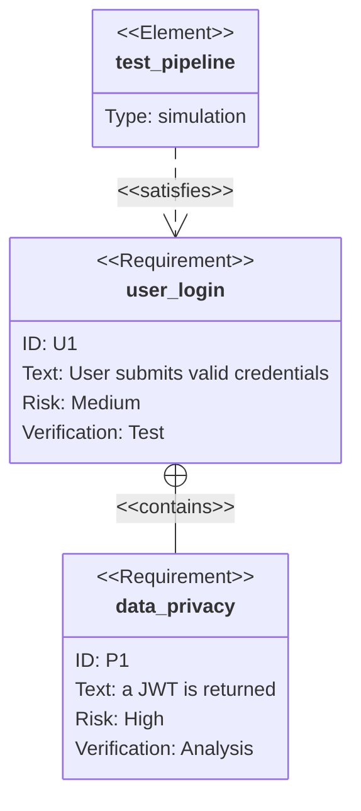

---
tags:
  - requirement
aliases:
created-at: "{{date}} {{time}}"
project:
parent:
ID: " REQ{{date}}{{time}}"
name:
description:
source:
  - customer
  - user
  - workflow
moscow: must-have/should-have/could-have/won't-have
acceptance-criteria:
  - manuel test
  - integration test
  - unit test
  - test automation
contents:
progress:
---
*Links:* 

---
# REQ{{date}}{{time}}-{{title}}
**İhtiyaç Belirleme**: Ekibin ihtiyaçlarını ve kullanıcı davranışlarını belirler.
## Kapsam
Bu Requirement dosyası, aşağıdaki bileşenleri içermelidir:
- MVP hedefleri ve kapsamı (ne olacak?, ne olmayacak?)
- Kullanıcı ihtiyaçları ve hedef kullanıcı profili (kime geliştiriyoruz?)
- Temel işlevler (fonksiyonel gereksinimler nelerdir? neyi yapabilmeli?)
- Performans, güvenlik ve uyumluluk gibi non-fonksiyonel gereksinimler (Sınırlarımız, kısıtlarımız ve metriklerimiz nelerdir?)
- Sistem mimarisi ve teknik altyapı bilgileri (Nasıl tasarlarız? İşlevleri yerine getirmesi için nasıl bir yapı kurulmalı?)
- Test stratejisi ve kabul kriterleri (Hangi kriterleri başarmalı? Branch coverage 100% olması için hangi caseler yakalanmalı?)
- İlerleyen aşamalarda eklenecek özellikler (roadmap)
- Gereksinimlerin izlenebilirliği ve sürdürülebilirliği için yapısal kurallar
## Requirement: `Kullanıcı Giriş`
Her gereksinim, **"İstek"** (Requirement) olarak tanımlanmalı. Her istek, aşağıdaki alanları içermelidir:
- **ID**: Benzersiz bir tanımlayıcı (örneğin: REQ-001)
- **İsim**: User Login
- **Açıklama**: The system SHALL issue a JWT on successful login.
- **Öncelik**: MoSCoW (Must-have, Should-have, Could-have, Won’t-have) veya benzeri bir yöntemle belirlenir
- **Doğrulama Yöntemi**: Bu gereksinimin test edilme şekli (örneğin: otomatik test, kullanıcı kabul testi)
### User Story
```
As a [description of user],
I want [functionality],
so that [benefit].
```
### Acceptance Criteria
```
Given [how things begin]
When [action taken]
Then [outcome of taking action]

--- or ---

Arrange [prepared produce steps]
Act [take the action]
Assert [assert and verify the output of behavior]
```
### Requirement Diagram

### User Journey Diagram

### State Diagram
